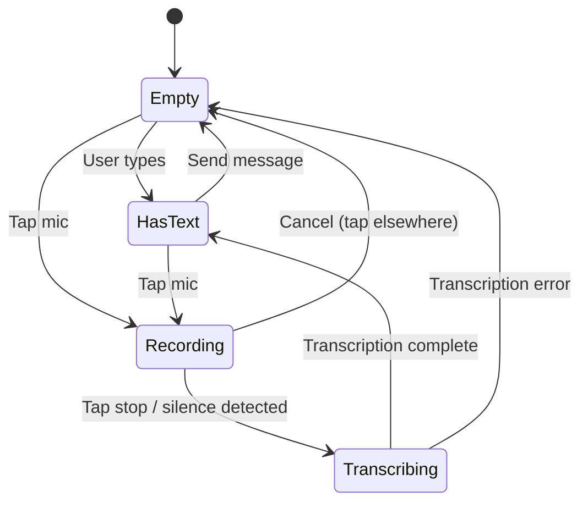

# Step 8: Voice Input for Chat

> Add voice recording to chat inputs with mic-to-text transcription using OpenAI Whisper.

## Overview

Add voice recording capability to chat inputs, similar to ChatGPT's interface. Users can tap a microphone icon to record audio, which is transcribed and placed in the input field for review before sending.

## User Experience

### Icon Layout (Right Side of Input)

```
┌─────────────────────────────────────────────────────────┐
│  [Ask a question...]                         🎤   〰️   │
└─────────────────────────────────────────────────────────┘
                                               ↑     ↑
                                              Mic  Wave/Send
```

### State Machine

| State | Input Field | Mic Icon | Right Icon | Right Icon Action |
|-------|-------------|----------|------------|-------------------|
| **Empty** | Empty | 🎤 Default | 〰️ Wave | Future voice mode (disabled) |
| **Has Text** | Has text | 🎤 Default | ➡️ Send | Submit message |
| **Recording** | Empty/Has text | 🎤 Pulsing red | ⏹️ Stop | Stop recording |
| **Transcribing** | "Transcribing..." | 🎤 Disabled | ⏳ Loader | Wait |

### User Flow



## Technical Architecture

### Components

| Component | Location | Purpose |
|-----------|----------|---------|
| `VoiceChatInput` | `src/components/ui/voice-chat-input.tsx` | Composite input with voice controls |
| `useVoiceRecording` | `src/hooks/use-voice-recording.ts` | Mic access, MediaRecorder, audio capture |
| `transcribe` | `supabase/functions/transcribe/index.ts` | OpenAI Whisper API proxy |

### Component Hierarchy

```
VoiceChatInput
├── Input (existing)
├── MicButton
│   └── Mic | MicOff (pulsing when recording)
└── ActionButton
    └── AudioWaveform | Send | Square | Loader2
```

### Hook: `useVoiceRecording`

```typescript
interface UseVoiceRecordingReturn {
  // State
  isRecording: boolean;
  isTranscribing: boolean;
  error: string | null;
  audioBlob: Blob | null;
  
  // Actions
  startRecording: () => Promise<void>;
  stopRecording: () => Promise<void>;
  cancelRecording: () => void;
  transcribe: () => Promise<string | null>;
}
```

**Implementation Notes:**
- Use `MediaRecorder` API with `audio/webm` format
- Request mic permissions on first use
- Auto-stop after 60 seconds (configurable)
- Handle permission denied gracefully

### Edge Function: `transcribe`

**Endpoint:** `POST /functions/v1/transcribe`

**Request:** `multipart/form-data`
- `audio`: Audio file (webm, mp3, wav, m4a)
- `language`: Optional language hint (e.g., "en", "es")

**Response:**
```json
{
  "text": "Transcribed text here",
  "language": "en"
}
```

**Implementation:**
```typescript
// supabase/functions/transcribe/index.ts
const formData = new FormData();
formData.append('file', audioBlob, 'recording.webm');
formData.append('model', 'whisper-1');
formData.append('language', language); // optional

const response = await fetch('https://api.openai.com/v1/audio/transcriptions', {
  method: 'POST',
  headers: {
    'Authorization': `Bearer ${OPENAI_API_KEY}`,
  },
  body: formData,
});
```

## Integration Points

### Files to Modify

1. **`src/pages/Ask.tsx`**
   - Replace `Input` + `Button` with `VoiceChatInput`

2. **`src/components/manual/AskAboutContent.tsx`**
   - Replace `Input` + `Button` with `VoiceChatInput`

3. **`supabase/config.toml`**
   - Add `transcribe` function entry

### Props Interface

```typescript
interface VoiceChatInputProps {
  value: string;
  onChange: (value: string) => void;
  onSubmit: () => void;
  placeholder?: string;
  disabled?: boolean;
  isLoading?: boolean;
  language?: 'en' | 'es';
  className?: string;
}
```

## UI/UX Details

### Icons (Lucide)

- `Mic` - Default microphone
- `MicOff` - Microphone disabled/error
- `AudioWaveform` - Voice mode (future, disabled)
- `Send` - Submit message
- `Square` - Stop recording
- `Loader2` - Transcribing spinner

### Visual States

**Recording State:**
- Mic icon uses `.pulse` animation (existing in tailwind.config)
- Red background: `bg-destructive/10`
- Red ring glow: `ring-2 ring-destructive/50 animate-pulse`
- Elapsed time badge: `0:00` → `0:59` shown near mic button
- Visual countdown warning at 50s (ring turns amber)

**Recording Animation (Custom):**
```css
/* Add to index.css if needed */
@keyframes recording-pulse {
  0%, 100% { 
    box-shadow: 0 0 0 0 hsl(var(--destructive) / 0.4);
  }
  50% { 
    box-shadow: 0 0 0 8px hsl(var(--destructive) / 0);
  }
}

.recording-indicator {
  animation: recording-pulse 1.5s ease-in-out infinite;
}
```

**Transcribing State:**
- Mic icon disabled (opacity-50)
- Loader spins in right position
- Input shows "Transcribing..." placeholder

### Recording Time Limit

**Max Duration: 60 seconds**

| Time | Behavior |
|------|----------|
| 0-50s | Normal recording, green/neutral timer |
| 50-59s | Warning state: timer turns amber, subtle pulse faster |
| 60s | Auto-stop, begin transcription |

**Why 60 seconds?**
- OpenAI Whisper has a 25MB file limit (~10 min of audio)
- 60s keeps files small (~500KB-1MB in webm)
- Encourages concise questions
- Configurable via `MAX_RECORDING_SECONDS` constant

**Timer Display:**
```
┌─────────────────────────────────────────────────────────┐
│  [Recording...]                      0:45   🎤   ⏹️    │
└─────────────────────────────────────────────────────────┘
                                        ↑
                                    Elapsed time
```

### Accessibility

- `aria-label` on all icon buttons
- Announce recording start/stop to screen readers
- Keyboard: Enter to send, Escape to cancel recording

## Error Handling

| Error | User Message | Recovery |
|-------|--------------|----------|
| Mic permission denied | "Microphone access denied. Check browser settings." | Show settings hint |
| Recording failed | "Recording failed. Please try again." | Reset to empty state |
| Transcription failed | "Couldn't transcribe audio. Please try again." | Keep audio, retry button |
| Network error | "Network error. Check your connection." | Retry button |

## Future: Voice Mode (Wave Icon)

The wave icon (`AudioWaveform`) will activate full voice mode in a future iteration:

- Real-time voice conversation
- Push-to-talk or VAD
- Audio responses from AI
- Separate implementation plan

**For now:** Wave icon is visible but disabled (shows tooltip "Coming soon").

## Implementation Steps

### Step 1: Create `transcribe` Edge Function

**File:** `supabase/functions/transcribe/index.ts`

1. Create new edge function directory and index.ts
2. Set up CORS headers
3. Accept `multipart/form-data` with audio file
4. Forward to OpenAI Whisper API (`https://api.openai.com/v1/audio/transcriptions`)
5. Return transcribed text
6. Add to `supabase/config.toml` with `verify_jwt = false`

**Key code:**
```typescript
const formData = new FormData();
formData.append('file', audioFile, 'recording.webm');
formData.append('model', 'whisper-1');
if (language) formData.append('language', language);

const response = await fetch('https://api.openai.com/v1/audio/transcriptions', {
  method: 'POST',
  headers: { 'Authorization': `Bearer ${OPENAI_API_KEY}` },
  body: formData,
});
```

---

### Step 2: Create `useVoiceRecording` Hook

**File:** `src/hooks/use-voice-recording.ts`

1. Request microphone permissions via `navigator.mediaDevices.getUserMedia`
2. Create `MediaRecorder` with `audio/webm` mimeType
3. Collect audio chunks in array
4. Track recording state: `idle` | `recording` | `transcribing`
5. Implement elapsed time counter with `setInterval`
6. Auto-stop at `MAX_RECORDING_SECONDS` (60s)
7. On stop: create Blob, call transcribe endpoint
8. Return: `{ isRecording, isTranscribing, elapsedSeconds, error, startRecording, stopRecording, cancelRecording }`

**Key code:**
```typescript
const mediaRecorder = new MediaRecorder(stream, { mimeType: 'audio/webm' });
mediaRecorder.ondataavailable = (e) => chunks.push(e.data);
mediaRecorder.onstop = () => {
  const blob = new Blob(chunks, { type: 'audio/webm' });
  transcribeAudio(blob);
};
```

---

### Step 3: Add Recording Animation to CSS

**File:** `src/index.css`

Add custom keyframes for the pulsing recording indicator:

```css
@keyframes recording-pulse {
  0%, 100% { box-shadow: 0 0 0 0 hsl(var(--destructive) / 0.4); }
  50% { box-shadow: 0 0 0 8px hsl(var(--destructive) / 0); }
}

.recording-indicator {
  animation: recording-pulse 1.5s ease-in-out infinite;
}
```

---

### Step 4: Create `VoiceChatInput` Component

**File:** `src/components/ui/voice-chat-input.tsx`

1. Accept props: `value`, `onChange`, `onSubmit`, `placeholder`, `disabled`, `language`
2. Import `useVoiceRecording` hook
3. Layout: `Input` + `MicButton` + `ActionButton`
4. **MicButton logic:**
   - Default: `Mic` icon
   - Recording: `Mic` icon with `.recording-indicator` class + red background
   - Show elapsed time badge when recording
5. **ActionButton logic:**
   - No text + not recording: `AudioWaveform` (disabled, tooltip "Coming soon")
   - Has text: `Send` icon (clickable)
   - Recording: `Square` icon (stop)
   - Transcribing: `Loader2` icon (spinning)
6. On transcription complete: call `onChange(transcribedText)`
7. Handle errors with toast notifications

**Component structure:**
```tsx
<div className="flex gap-sm">
  <Input ... />
  <div className="flex gap-xs">
    <Button onClick={toggleRecording}>
      <Mic className={isRecording ? 'recording-indicator' : ''} />
      {isRecording && <span>{formatTime(elapsedSeconds)}</span>}
    </Button>
    <Button onClick={handleAction}>
      {getActionIcon()}
    </Button>
  </div>
</div>
```

---

### Step 5: Integrate into `Ask.tsx`

**File:** `src/pages/Ask.tsx`

1. Import `VoiceChatInput`
2. Replace the existing `Input` + `Button` combo (lines ~170-186) with:
```tsx
<VoiceChatInput
  value={question}
  onChange={setQuestion}
  onSubmit={handleAsk}
  placeholder={language === 'es' ? '...' : '...'}
  disabled={isLoading || isAtLimit}
  language={language}
/>
```

---

### Step 6: Integrate into `AskAboutContent.tsx`

**File:** `src/components/manual/AskAboutContent.tsx`

1. Import `VoiceChatInput`
2. Replace the existing `Input` + `Button` combo (lines ~278-295) with:
```tsx
<VoiceChatInput
  value={question}
  onChange={setQuestion}
  onSubmit={handleSubmit}
  placeholder={labels.placeholder}
  disabled={isLoading || isAtLimit}
  language={language}
/>
```

---

### Step 7: Add Error Handling & Toasts

1. In `useVoiceRecording`, catch and surface errors:
   - Microphone permission denied
   - Recording failed
   - Transcription API error
2. In `VoiceChatInput`, show toasts for errors using `sonner`
3. Add retry capability for transcription failures

---

### Step 8: Test & Verify

1. **Desktop browsers:** Chrome, Firefox, Safari
2. **Mobile browsers:** iOS Safari, Android Chrome
3. **Permission flows:** First-time grant, denied, revoked
4. **Edge cases:** 
   - Cancel mid-recording
   - Auto-stop at 60s
   - Empty audio (silence only)
   - Network failure during transcription

---

## Implementation Checklist

- [ ] Step 1: Create `transcribe` edge function
- [ ] Step 2: Create `useVoiceRecording` hook
- [ ] Step 3: Add recording animation CSS
- [ ] Step 4: Create `VoiceChatInput` component
- [ ] Step 5: Integrate into `Ask.tsx`
- [ ] Step 6: Integrate into `AskAboutContent.tsx`
- [ ] Step 7: Add error toasts
- [ ] Step 8: Test on desktop/mobile browsers

## Dependencies

**Existing:**
- `lucide-react` (icons)
- `OPENAI_API_KEY` (already configured)

**No new dependencies required.**

## Security Considerations

- Audio files are sent to edge function, not stored
- Edge function proxies to OpenAI, never exposes API key
- Consider rate limiting transcription endpoint
- Audio is discarded after transcription

## Estimated Effort

| Task | Estimate |
|------|----------|
| `useVoiceRecording` hook | 1-2 hours |
| `transcribe` edge function | 30 min |
| `VoiceChatInput` component | 1-2 hours |
| Integration + testing | 1 hour |
| **Total** | ~4-5 hours |
